# 06 - Artifact Repo Manager

This is my solution of the exercise 6 - Artifact Repository Manager with Nexus of the [TechWorld with Nana DevOps Bootcamp](https://www.techworld-with-nana.com/devops-bootcamp)

# Exercises

## Exercise 1: Install Nexus on a server

- Droplet with 8GB of RAM with Java 8 installed

```bash
cd /opt
wget https://download.sonatype.com/nexus/3/latest-unix.tar.gz
tar -zxvf latest-unix.tar.gz
ls

adduser nexus
ls -l

# Nexus user needs permissions to execute nexus executable 
# and to read/write sonatype-work folder

# change ownership recursively for nexus user and nexus group
chown -R nexus:nexus nexus-3.41.1-01
chown -R nexus:nexus sonatype-work
ls -l

vim nexus-3.41.1-01/bin/nexus.rc

# uncomment the line and add nexus user, it should look like:
# run_as_user="nexus"
# Save and quit

su - nexus
/opt/nexus-3.41.1-01/bin/nexus start
ps aux | grep nexus # check that it is running
netstat -lnpt # match the PID with previous command to find the Nexus ports
```

## Exercise 2: Create npm hosted repository

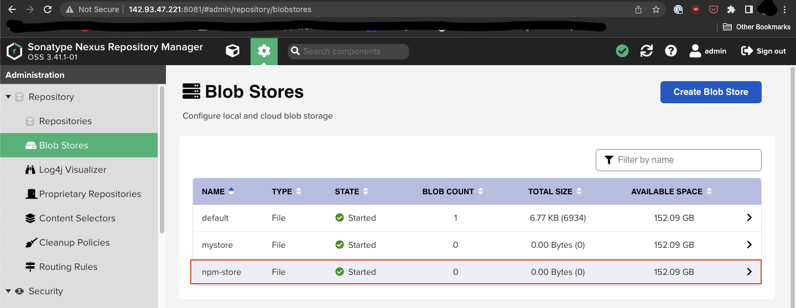

Blob Store for npm

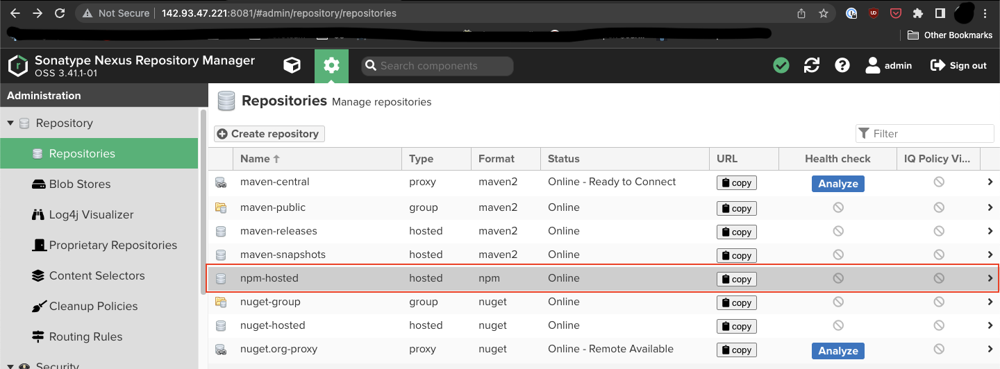

npm hosted repository

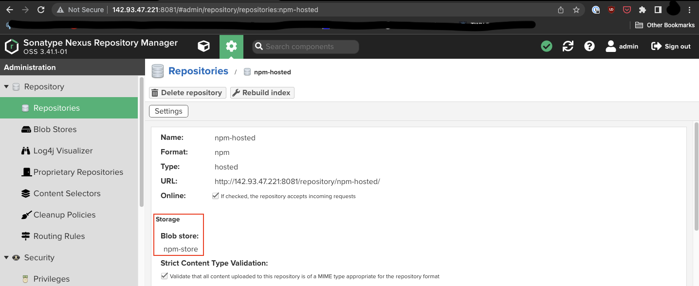

npm hosted repository using npm blob store

## Exercise 3: Create user for team 1

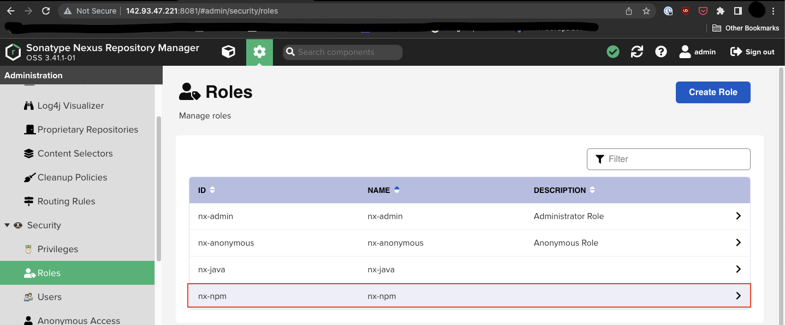

new npm role

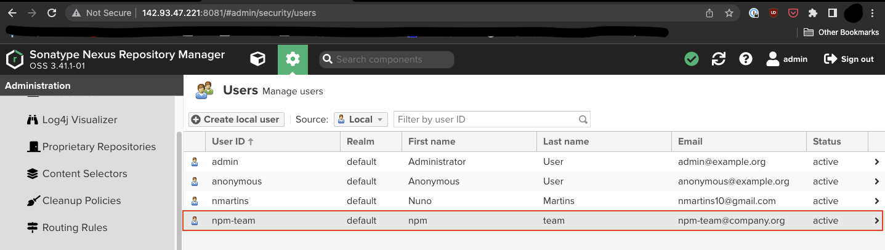

new npm-team user

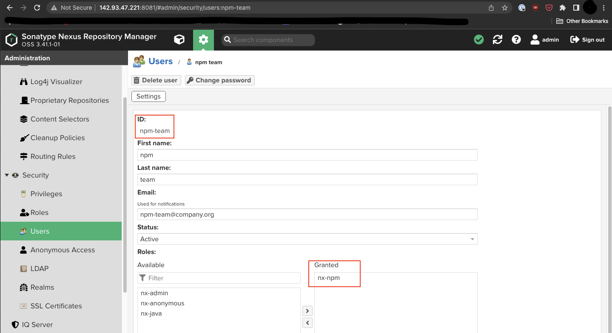

npm-team user with new role granted

## Exercise 4: Build and publish npm tar

```bash
# Reuse the project from last exercise
cp -r twn-devops-bootcamp-ex05 twn-devops-bootcamp-ex06
cd twn-devops-bootcamp-ex06/app

npm pack # if .tgz file not built yet

# Run the following command and take note of the output.
# Replace your credentials
echo -n 'npm-team:MySuperPass' | openssl base64

vim .npmrc # Put the content shown below of .npmrc file

vim package.json # Add the "publishConfig" section shown bellow

npm publish 
```

```bash
init.author.name = John Smith
init.author.email = john.smith@my-org.com
email=npm-team@company.com

always-auth=true

registry=http://142.93.47.221:8081/repository/npm-hosted/
# base64-encoding of the username-password pair for your Nexus Repository
# Example: echo -n 'npm-team:MySuperPass' | openssl base64
_auth=bnBtLXRlYW06TU9xeHk4NTch
```

```bash
"publishConfig": {
	"registry": "http://142.93.47.221:8081/repository/npm-hosted/"
}
```

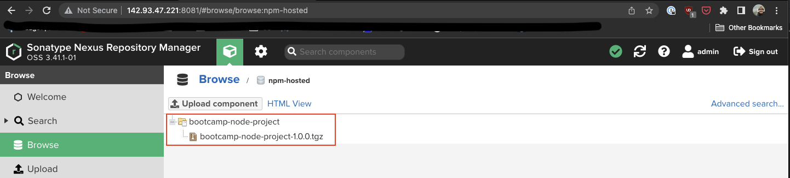

## Exercise 5: Create maven hosted repository

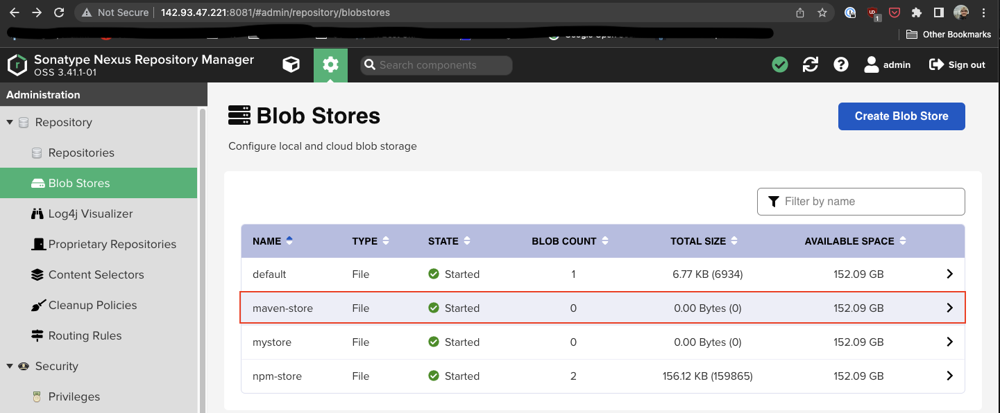

Blob Store for maven

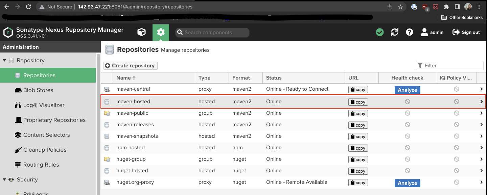

maben hosted repository

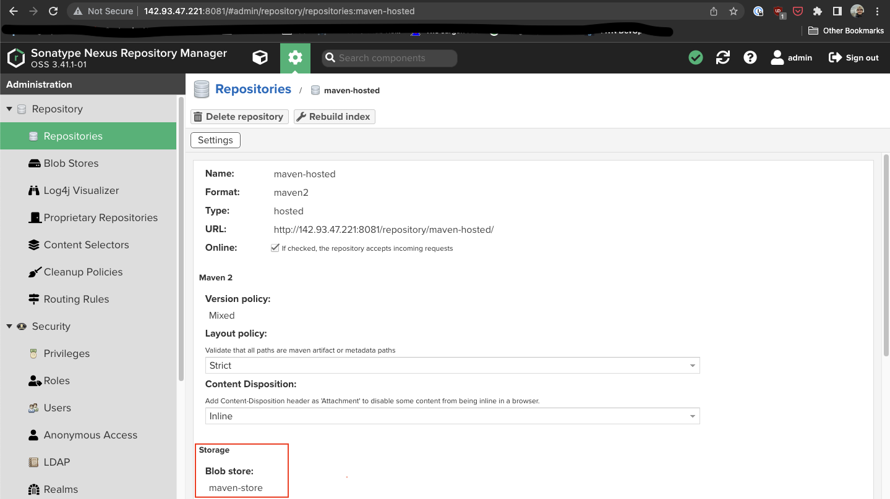

maven hosted repository using maven blob store

## Exercise 6: Create user for team 2

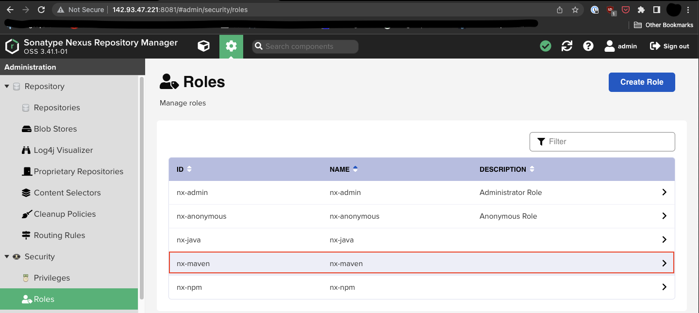

new maven role

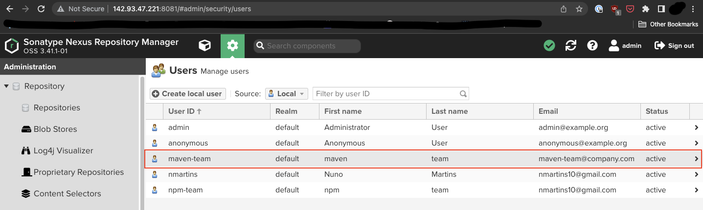

new maven-team user

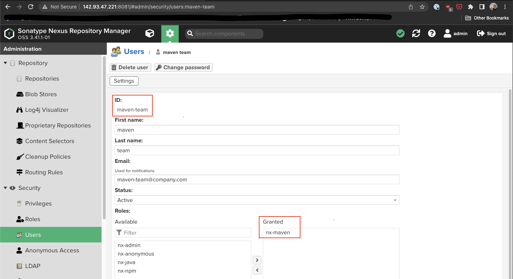

maven-team user with new role granted

## Exercise 7: Build and publish jar file

```groovy
plugins {
    id 'java'
    id 'org.springframework.boot' version '2.2.2.RELEASE'
    id 'io.spring.dependency-management' version '1.0.8.RELEASE'
}

group 'com.example'
version '1.0-SNAPSHOT'

sourceCompatibility = 1.8

apply plugin: 'maven-publish'
publishing {
    publications {
        maven(MavenPublication) {
            artifact("build/libs/java-gradle-app-$version" + ".jar") {
                extension 'jar'
            }
        }
    }

    repositories {
        maven {
            name 'nexus'
            url "http://142.93.47.221:8081/repository/maven-hosted/"
            allowInsecureProtocol = true
            credentials {
                username project.repoUser
                password project.repoPassword
            }
        }
    }
}

repositories {
    mavenCentral()
}

dependencies {
    implementation 'org.springframework.boot:spring-boot-starter-web'
    implementation group: 'net.logstash.logback', name: 'logstash-logback-encoder', version: '5.2'
    testImplementation group: 'junit', name: 'junit', version: '4.12'
}
```

```bash
repoUser = maven-team
repoPassword = MySuperPass
```

```groovy
rootProject.name = 'java-gradle-app'
```

```bash
./gradlew build
./gradlew publish
```

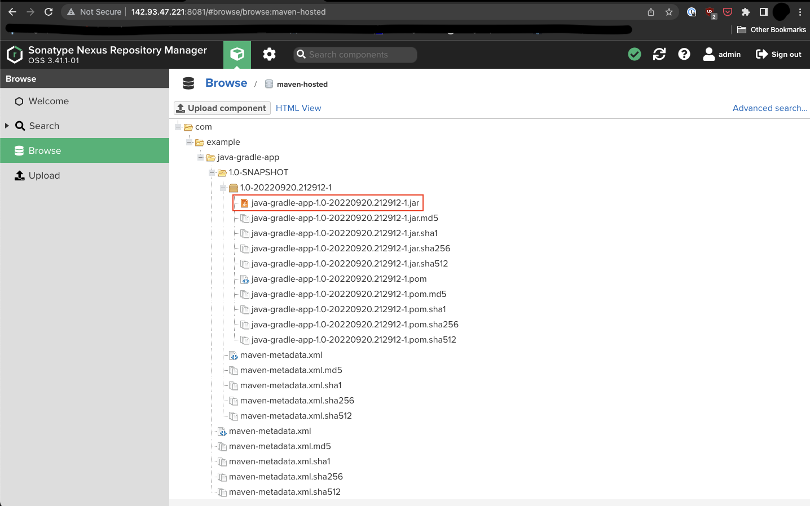

## Exercise 8: Download from Nexus and start application

```bash
# Here npm-maven-team is a new Nexus user with access to both maven and npm repos
curl -u npm-maven-team:MySuperUser -X GET 'http://142.93.47.221:8081/service/rest/v1/components?repository=npm-hosted&sort=version'
```

```json
{
  "items" : [ {
    "id" : "bnBtLWhvc3RlZDoyYTU5MDQzZWQyZWE1NTZlMzQ0ODQwNjVmMDU1MzYwZA",
    "repository" : "npm-hosted",
    "format" : "npm",
    "group" : null,
    "name" : "bootcamp-node-project",
    "version" : "1.0.0",
    "assets" : [ {
      "downloadUrl" : "http://142.93.47.221:8081/repository/npm-hosted/bootcamp-node-project/-/bootcamp-node-project-1.0.0.tgz",
      "path" : "bootcamp-node-project/-/bootcamp-node-project-1.0.0.tgz",
      "id" : "bnBtLWhvc3RlZDpjMGFjMmFiNmM1ZTkzYTRhMzdlNDEzNjg3MjNmNGY3Yw",
      "repository" : "npm-hosted",
      "format" : "npm",
      "checksum" : {
        "sha1" : "80d156e8b107efe2ce540733916c05869857f49c"
      },
      "contentType" : "application/gzip",
      "lastModified" : "2022-09-20T20:39:15.781+00:00",
      "lastDownloaded" : null,
      "uploader" : "npm-team",
      "uploaderIp" : "2.82.244.159",
      "fileSize" : 158848,
      "blobCreated" : "2022-09-20T20:39:15.781+00:00",
      "lastDownloaded" : null,
      "npm" : {
        "name" : "bootcamp-node-project",
        "version" : "1.0.0"
      }
    } ]
  } ],
  "continuationToken" : null
}
```

```bash
wget --user=npm-maven-team --password=MySuperPass http://142.93.47.221:8081/repository/npm-hosted/bootcamp-node-project/-/bootcamp-node-project-1.0.0.tgz
tar xvzf bootcamp-node-project-1.0.0.tgz # extract the file content
cd package

# Since this is a new Droplet let's update and install npm
apt update
apt install npm

# Install dependencies
npm install

# Start the app in detached mode
node server.js &
# You will see a message like 'app listening on port 3000!'
# Take note of the port and open it if using a new firewall
```

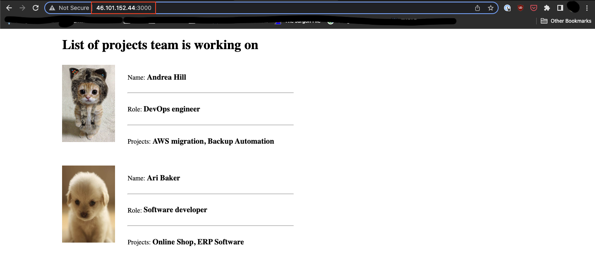

Note the different IP in the url, this is a different droplet from the one that is running Nexus

## Exercise 9: Automate

```bash
#!/bin/bash

echo "connecting to Nexus to get artifact metadata..."
curl -u npm-maven-team:MySuperPass -X GET 'http://142.93.47.221:8081/service/rest/v1/components?repository=npm-hosted&sort=version' | jq "." > artifact.json

artifactDownloadUrl=$(jq '.items[].assets[].downloadUrl' artifact.json --raw-output)
artifactName=$(jq '.items[].assets[].npm.name' artifact.json --raw-output)"-"$(jq '.items[].assets[].npm.version' artifact.json --raw-output)".tgz"

echo "Downloading artifact..."
wget --user=npm-maven-team --password=MySuperPass $artifactDownloadUrl

tar xvzf $artifactName
cd package

echo "installing dependencies..."
npm install

echo "cleaning up..."
rm ../artifact.json

echo "Starting server..."
node server.js &
```

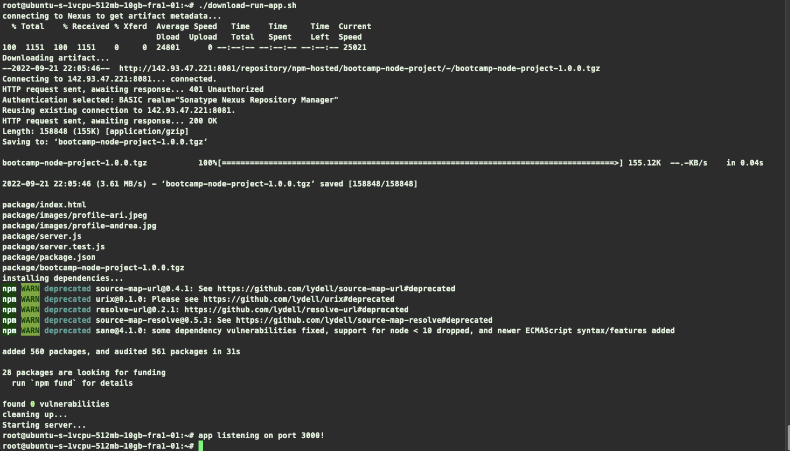

output of running ./download-run-app.sh