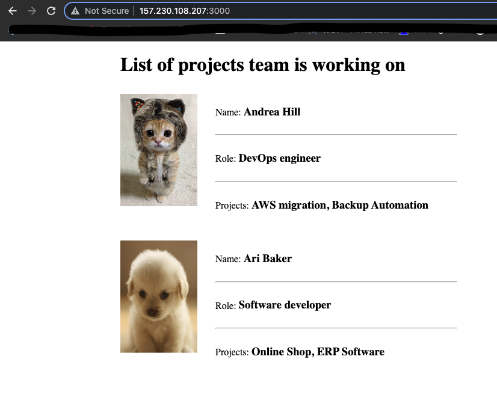

# 05 - Cloud & IaaS Basics

This is my solution of the exercise 5 - Cloud & IaaS Basics - DigitalOcean of the [TechWorld with Nana DevOps Bootcamp](https://www.techworld-with-nana.com/devops-bootcamp)

# Exercises

## Exercise 0: Clone Git Repository

```bash
git clone git@gitlab.com:devops-bootcamp3/node-project.git
mv node-project twn-devops-bootcamp-ex05
cd twn-devops-bootcamp-ex05

# Created an empty repository on GitHub
# https://github.com/ngmmartins/twn-devops-bootcamp-ex05.git

git remote set-url origin git@github.com:ngmmartins/twn-devops-bootcamp-ex05.git
git branch -M main
git push -u origin main
```

## Exercise 1: Package NodeJS App

```bash
cd app
npm pack # Creates a packaged app (bootcamp-node-project-1.0.0.tgz)
```

## Exercise 2: Create a new server

Steps on Digital Ocean UI to accomplish this on 17-09-2022:

- Manage → Droplets → Create Droplet
    - I've selected the following resources:
        - Distribution: Ubuntu 22.04 x64
        - Plan: Shared CPU Basic
        - CPU Options: Regular with SSD
            - RAM: 512MB
            - CPU: 1
            - SSD: 10GB
            - Transfer: 500GB
        - Location: Frankfurt
        - Authentication:
            - SSH keys → New SSH Key → Paste content of my Public SSH Key → Give it a name → Add SSH Key
        - Hostname: twn-devops-bootcamp-ex05
- Hit Create Droplet
- Select the created Droplet → Firewalls → Edit → Create Firewall
    - Name: twn-devops-bootcamp-ex05
    - Inbound Rules:
        - Type: SSH
        - Protocol: TCP
        - Port Range: 22
        - Sources: I've added my real IP address
- In the "Apply to Droplets" select the created Droplet → Hit Create Firewall

## Exercise 3: Prepare server to run Node App

In the UI we can view and copy the Droplet IP Address, let's assume for this exercise it is 157.230.108.207

```bash
ssh root@157.230.108.207
apt update
apt install nodejs
nodejs -v # to verify installation
apt install npm
npm -v # to verify installation

# To not use the root account I created a dedicated user to run the app
adduser nodeapp
usermod -aG sudo nodeapp # Add the user to the sudo group
su - nodeapp # change to nodeapp user
mkdir .ssh

# To allow the new user(nodeapp) to login with the SSH key we need to add it's 
# Public SSH Key to the following file:
sudo vim .ssh/authorized_keys # Paste Public SSH Key in this file. Save and quit

exit # logout nodeapp user
exit # logout root user and disconnect from remote server

# Now you can login with nodeapp user using the SSH key:
ssh nodeapp@157.230.108.207
```

## Exercise 4: Copy App and package.json

From your local command line run the following:

```bash
# Make sure you are inside the 'app' folder
# The following command will copy the bootcamp-node-project-1.0.0.tgz 
# to the home directory of the nodeapp user
scp bootcamp-node-project-1.0.0.tgz nodeapp@157.230.108.207:~
```

From you nodeapp command line on the droplet run the following:

```bash
# Make sure you are in nodeapp home dir (/home/nodeapp)
ls # This should show the bootcamp-node-project-1.0.0.tgz copied before
tar xvzf bootcamp-node-project-1.0.0.tgz # extract the file content
mv package app # rename the extracted 'package' folder to 'app'
cd app
```

## Exercise 5: Run Node App

Still in the remote command line

```bash
# You sould be inside '/home/nodeapp/app'
npm install # This will install the needed dependencies

# Start the app in detached mode
node server.js &
# You will see a message like 'app listening on port 3000!'
# Take note of the port
```

## Exercise 6: Access from browser - configure firewall

In the DigitalOcean UI do the following:

- Networking → Firewalls → Select the one created before
    - Add a new Inbound Rules:
        - Type: Custom
        - Protocol: TCP
        - Ports: 3000 (the port you noted before when starting the app)
        - Sources: All IPv4 All IPv6
- Hit Save

Open you browser on http://157.230.108.207:3000


